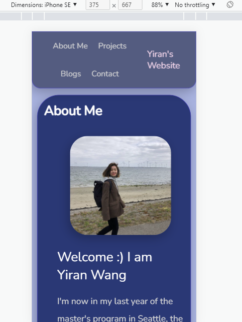

## The link to the website:
https://yiranluc.github.io/Personal-Website/

1. What was the most challenging piece of this assignment?  Did you find it easy or challenging to work with HTML and CSS?  How long did this overall assignment take you?

- Making it mobile-first is the most challenging part for me. I have to try different ways to let all the blogs or photos decrease their width as screen goes smaller. It is not hard to write HTML and CSS. But mastering CSS is still a long way to go. This assignment took me around 30 hours in total.

2. What decisions did you make when you made your site mobile friendly?
- First, regarding the navigation items, when the screen turns to mobile screen size, due to its flex structure, some texts may get wrapped around and look not that pretty. So I grouped all the clickable menu links in one flex box and wrap the menu link and my website's name in another bigger flex box. In this way, even when we use a Iphone SE screen size, users would still be able to see all the texts on the navbar in a good way, as shown in image below.

- Second, regarding the avatar photo in the `About Me` page, I manually changed its max-width when the screen width goes below certain point.

- Last but not least, thanks to the grid structure used by the `Projects` and `Blogs` page, they can be easily adjusted to suit different screen sizes. For example, we can change grid's padding or the maximum number of items on each row when screen width goes down.

3. What did you take into account when you developed the design of your website?  Is there anything that you’re particularly proud of?
- During design, I wanted to add some special icons to my website. I am pretty proud of the small icons from ionic I have used in my website. I found this library by chance online. But they indeed make my website more attractive.

4. Given more time or resources, what additional features would you add to your site in the future?
- I think I would like to add a section called "Skills" and highlight all the technical skills I am good at. 

5. How many hours did you spend on this assignment?

- 30-35 hours in total.

6. If you used code or design from somewhere online, please mention it here.  Furthermore, if you imported a file to use a Fonts or Icons library, please indicate that here as well.

- I used icons from the website https://ionic.io/ionicons. And I used Google fonts from https://fonts.google.com/specimen/Nunito.
